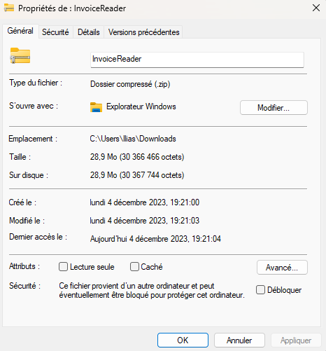

# Invoice-Reader

⚠️⚠ To Use Database ⚠⚠️

Create a folder named "Database" in your Desktop and put .acdb file into it.

⚠️⚠️⚠️ ERROR PROJECT ⚠️⚠️⚠️

# How to Unblock a Downloaded ZIP File

After downloading a ZIP file, you may need to unblock it to avoid security warnings from Windows. Here's how you can do this:

1. Locate the downloaded ZIP file in your file explorer.
2. Right-click on the ZIP file and select 'Properties' at the bottom of the context menu.
3. In the Properties window, look for the 'Security' section at the bottom.
4. You will see a checkbox next to the text "This file came from another computer and might be blocked to help protect this computer."
5. Check the 'Unblock' checkbox.
6. Click 'Apply' to save the changes, then 'OK' to close the Properties window.

By following these steps, you should be able to work with the ZIP file without any restrictions imposed by Windows.

Here is an image to guide you through the process:

